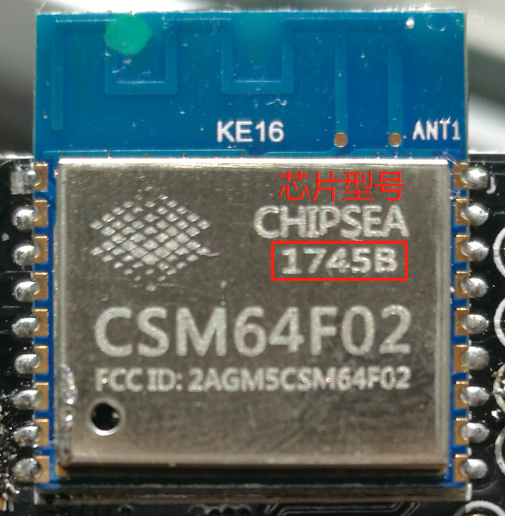

# 将斐讯DC1排插接入大讯云物联网平台

斐讯DC1智能排插，由于某些原因斐讯公司的服务器已经关闭，官方app已经无法再使用。排插失去远程控制的功能，所以价格也沦为普通排插的价格。但是可以通过自主搭建MQTT服务器实现远程控制。

1. 低成本
2. 可在线升级（OTA）
3. 可查看电压、电流、功率
4. 改造现成插座，简单，美观
5. 间接有了智能台灯、智能风扇......
6. APP远程控制（暂只支持iOS端）：在苹果App Store搜索“大讯云”使用APP调试工具控制 或 大讯云开源的[智能插座APP](https://github.com/daxunyun-com/SmartOutlet2iOS)

 

## 使用方法
1. 部署大讯云到自己的服务器上，部署方法可以看：[从零开始搭建企业自己的私有智能物联网云平台](https://bbs.daxunyun.com/thread/5/detail.html)
2. git clone https://github.com/daxunyun-com/phicomm_dc1.git
3. 修改 mqtt_config.h文件
- `MQTT_HOST` 部署后的服务器域名或IP
- `MQTT_PORT` 部署后的服务器端口号
- `MQTT_USER` MQTT用户名
- `MQTT_PASS` MQTT密码
- `ACCESSKEY` 新建产品后，在产品信息找到Access Key填
- `SECRETKEY` 新建产品后，在产品信息找到Secret Key填
- `SN` 把你的DC1序列号先在后台产品信息->产品序列号进行添加，然后把序列号写在这里
4. 修改 Makefile 文件
* 芯片型号带B为8Mbit  `SPI_SIZE_MAP?=2`
* 芯片型号不带B为16Mbit  `SPI_SIZE_MAP?=5`
*  
5. [拆解DC1排插](https://github.com/Samuel-0-0/phicomm_dc1-esphome/tree/master/cookbook)取出控制板
6. [编译下载](https://wiki.ai-thinker.com/esp8266)
* 使用USB转TTL下载
* 下载前请先拉低IO0(按下白色按键)
*  
7. 重新上电LED慢闪即固件刷入成功
8. 将控制板安装回插排中(请将后盖盖好再插上电源)
9. 长按总开关WIFI信号灯快闪进入配网模式
10. 进行配网（ESPTouch、Airkiss）

## 使用说明
1. 任意开关打开都会触发总开关
2. USB的开关随总开关的状态
3. WIFI信号灯慢闪即正在连接WIFI
4. WIFI信号灯快闪即进入配网模式
5. WIFI信号灯常亮即成功连接WIFI 
6. 长按（5秒）总开关进入配网模式，用于重新配网


## 数据点
在大讯云物联网平台的后台，产品管理->产品信息->数据点管理，导入以下数据点：
```
{"0":{"data_type":1,"data_value":1,"name":"logo_light","remark":"logo灯，0x00关闭，0x01打开"},"1":{"data_type":1,"data_value":1,"name":"wifi_light","remark":"wifi灯，0x00关闭，0x01打开"},"10":{"data_type":1,"data_value":2,"name":"power","remark":"功率"},"2":{"data_type":1,"data_value":1,"name":"switch_total","remark":"总开关，0x00关闭，0x01打开"},"3":{"data_type":1,"data_value":1,"name":"switch1","remark":"独立开关一，0x00关闭，0x01打开。0x03、0x04、0x05分别设置1，2，3组定时，data7小时，data8分钟。0x05、0x06、0x07分别取消1，2，3组定时，小时分钟可不填。"},"4":{"data_type":1,"data_value":1,"name":"switch2","remark":"独立开关二，0x00关闭，0x01打开。0x03、0x04、0x05分别设置1，2，3组定时，data7小时，data8分钟。0x05、0x06、0x07分别取消1，2，3组定时，小时分钟可不填。"},"5":{"data_type":1,"data_value":1,"name":"switch3","remark":"独立开关三 ，0x00关闭，0x01打开。0x03、0x04、0x05分别设置1，2，3组定时，data7小时，data8分钟。0x05、0x06、0x07分别取消1，2，3组定时，小时分钟可不填。"},"6":{"data_type":1,"data_value":1,"name":"hour","remark":"定时，小时 0-23"},"7":{"data_type":1,"data_value":1,"name":"minute","remark":"定时，分钟 0-59"},"8":{"data_type":1,"data_value":2,"name":"voltage","remark":"电压"},"9":{"data_type":1,"data_value":2,"name":"current","remark":"电流"}}
```

## 特性
本固件使用斐讯DC1排插硬件为基础,实现以下功能：
- [x] 4个USB充电
- [x] 按键控制所有插口通断
- [x] 控制每个接口独立开关
- [x] ota在线升级
- [x] 接入大讯云实现远程控制
- [x] app实时显示功率/电压/电流(不做任何精度保证)

后续准备增加功能：
- [ ] 定时开关
- [ ] 天猫精灵语音控制
- [ ] 小度在家语音控制
- [ ] 小米小爱语音控制

## 免责申明
以上纯属个人爱好研究，因为使用上述方法造成的任何问题或法律法规问题，不承担任何责任。

部分图片来源于网络，如果涉及版权，请通知删除。
